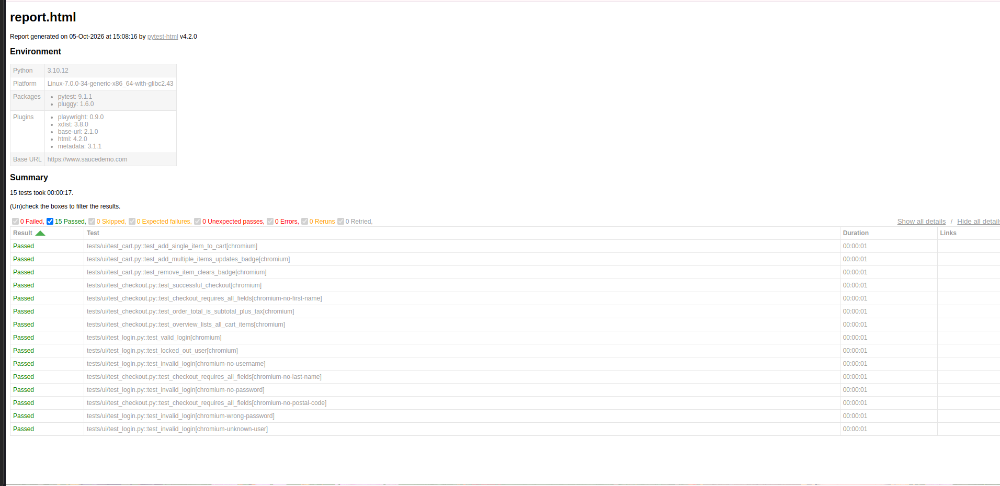
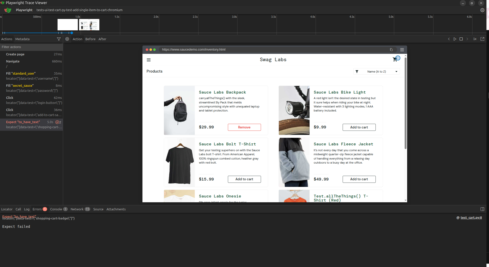

# Playwright QA Framework


End-to-end UI test automation framework for the practice e-commerce site [Sauce Demo](https://www.saucedemo.com), built with **Python, Pytest and Playwright** using the **Page Object Model**. Tests run automatically on every push through **GitHub Actions**.

## What it covers

| Area | Tests |
|------|-------|
| Login | valid login, locked-out user, 4 negative cases (missing / wrong credentials) |
| Cart | add one item, add multiple items, remove item |
| Checkout | full successful order, 3 missing-field validations, subtotal + tax = total, multi-item overview |

15 tests in total, tagged with `smoke` and `negative` markers.

## Key features

- **Page Object Model** with a shared `BasePage` for maintainable locators and actions
- **Reusable fixtures** (`login_page`, `inventory_page`, `checkout_ready`) so each test starts in the right state
- **Data-driven tests** using `pytest.mark.parametrize` and JSON test data
- **Positive and negative scenarios**
- **Parallel execution** with `pytest-xdist`
- **Cross-browser support** (Chromium, Firefox, WebKit)
- **Failure artifacts**: screenshots, videos and Playwright traces on failure
- **HTML reports** with `pytest-html`
- **CI pipeline**: runs on every push and pull request, nightly, and on demand

## Screenshots





## Project structure

```
playwright-qa-framework/
├── .github/workflows/tests.yml   # CI pipeline
├── pages/                        # Page Object classes
│   ├── base_page.py
│   ├── login_page.py
│   ├── inventory_page.py
│   ├── cart_page.py
│   └── checkout_page.py
├── tests/ui/                     # Test files
├── test_data/                    # JSON test data
├── conftest.py                   # Shared fixtures
├── pytest.ini                    # Pytest and Playwright options
└── requirements.txt
```

## Getting started

```bash
git clone https://github.com/amnataj/playwright-qa-framework.git
cd playwright-qa-framework
python3 -m venv .venv
source .venv/bin/activate          # Windows: .venv\Scripts\activate
python -m pip install -r requirements.txt
python -m playwright install
```

## Running the tests

```bash
python -m pytest                                      # all tests (headless)
python -m pytest --headed                             # watch the browser
python -m pytest -m smoke                             # smoke tests only
python -m pytest -n 4                                 # run in parallel
python -m pytest --browser firefox --browser webkit   # cross-browser
```

Reports are written to `reports/report.html`. Screenshots, videos and traces for failed tests are saved in `test-results/`. To inspect a trace:

```bash
python -m playwright show-trace test-results/<test-folder>/trace.zip
```

To test another environment, set `BASE_URL`:

```bash
BASE_URL=https://staging.example.com python -m pytest
```

## Continuous integration

The GitHub Actions workflow installs dependencies and Chromium, runs the suite in parallel, and uploads the HTML report and traces as a downloadable artifact, even when tests fail.

## What I learned

- **Parallel runs exposed a configuration bug.** Tests passed in a single process but failed with `-n 2` because the base URL set in `pytest.ini` wasn't reaching the workers. Defining a `base_url` fixture in `conftest.py` fixed it.
- **CI configuration is part of the test code.** My first pipeline run didn't start because the workflow file was in the wrong folder. Reading the run history and fixing the path taught me how GitHub Actions discovers workflows.
- **Fixtures keep tests short.** Moving login and cart setup into fixtures kept each test focused on one behaviour.
